# Enterprise Data Warehouse Architecture

## 1. High Level Data Architecture

```plantuml
@startuml HighLevelArchitecture

skinparam {
  BackgroundColor      #FAFAFA
  RoundCorner          15
  DefaultTextAlignment center
  componentStyle       uml2
  DefaultFontSize      11
  TitleFontSize        16
  PackageFontSize      14
}

skinparam cloud {
  BackgroundColor #E8F5E8
  BorderColor     #4CAF50
  FontColor       #2E7D32
}

skinparam database {
  BackgroundColor #FFF3E0
  BorderColor     #FF8F00
  FontColor       #E65100
}

skinparam interface {
  BackgroundColor #F3E5F5
  BorderColor     #9C27B0
  FontColor       #6A1B9A
}

skinparam component {
  BackgroundColor #FFFFFF
  BorderColor     #CCCCCC
  FontColor       #333333
}

skinparam package {
  BackgroundColor #F8F9FA
  BorderColor     #6C757D
  FontColor       #495057
}

left to right direction
title <size:18><b>🏗️ High Level Data Architecture</b></size>

cloud "📁 Data Sources" as Sources {
  folder "🏢 ERP System" as ERP {
   component "📄 <b>File Types</b>\n────────────\n📊 CSV Files\n\n📋 <b>Data Content</b>\n────────────\n👥 Customer Reference\n📦 Inventory Reference\n🗺️ Location Reference" as ERPComp
  }
  folder "🤝 CRM System" as CRM {
   component "📄 <b>File Types</b>\n────────────\n📊 CSV Files\n\n📋 <b>Data Content</b>\n────────────\n👤 Customer Information\n🛍️ Product Information\n💰 Sales Details" as CRMComp
  }
}

package "🏭 Data Warehouse [SQL Server]" as Warehouse {
  database "🥉 <b>Bronze Layer</b>\n<i>[Raw Data Extraction]</i>" as Bronze {
   component "🔧 <b>Technical Details</b>\n─────────────────\n📋 <b>Storage:</b> Tables\n\n⚙️ <b>Load Strategy:</b>\n   • 🔄 Batch Processing\n   • 📥 Full Load\n   • 🗑️ Truncate & Insert\n\n🔄 <b>Transformations:</b> None\n📊 <b>Data Modeling:</b> None" as BronzeComp
  }
  
  database "🥈 <b>Silver Layer</b>\n<i>[Data Transformation]</i>" as Silver {
   component "🔧 <b>Technical Details</b>\n─────────────────\n📋 <b>Storage:</b> Tables\n\n⚙️ <b>Load Strategy:</b>\n   • 🔄 Batch Processing\n   • 📥 Full Load\n   • 🗑️ Truncate & Insert\n\n🔄 <b>Transformations:</b>\n   • ⚖️ Standardization\n   • 📏 Normalization\n   • ➕ Column Derivation\n   • 🧹 Cleansing & Enrichment\n\n📊 <b>Data Modeling:</b> None" as SilverComp
  }
  
  database "🥇 <b>Gold Layer</b>\n<i>[Business Ready Data]</i>" as Gold {
   component "🔧 <b>Technical Details</b>\n─────────────────\n📋 <b>Storage:</b> Views\n\n⚙️ <b>Load Strategy:</b> None\n\n🔄 <b>Transformations:</b>\n   • 🔗 Data Integration\n   • 📈 Aggregation\n   • 🧠 Business Logic\n\n📊 <b>Data Modeling:</b>\n   • ⭐ Star Schema\n   • 📋 Flat Tables\n   • 📊 Aggregated Tables" as GoldComp
  }
}

rectangle "📊 Data Consumption" as Consumption {
  interface "📈 <b>BI & Reporting</b>\n────────────\n🔍 Analytics\n📊 Dashboards\n📋 Reports" as BI
  interface "🗃️ <b>SQL Queries</b>\n────────────\n💻 Ad-hoc Analysis\n🔍 Data Exploration\n⚡ Direct Access" as SQL
  interface "🤖 <b>Machine Learning</b>\n────────────\n🧠 AI Models\n🔮 Predictions\n📈 Advanced Analytics" as ML
}

Sources -[#4CAF50,thickness=3]-> Bronze
Bronze -[#FF8F00,thickness=3]-> Silver 
Silver -[#FFC107,thickness=3]-> Gold 
Gold -[#9C27B0,thickness=3]-> BI
Gold -[#9C27B0,thickness=3]-> SQL
Gold -[#9C27B0,thickness=3]-> ML

@enduml
```



## 2. ETL Process Flow


## 3. Data Warehouse Architecture (Detailed)


## 4. Data Modeling - Star Schema


## 5. Data Integration Process


## 6. Separation of Concerns (SOC) Architecture


## 7. Data Catalog Architecture


## 8. Bulk Insert vs Normal Insert Process

```plantuml
@startuml BulkInsertComparison

skinparam {
  BackgroundColor #FFFFFF
  RoundCorner 8
  DefaultTextAlignment center
}

skinparam rectangle {
  BackgroundColor #E8F6F3
  BorderColor #1ABC9C
  FontColor #148F77
}

skinparam activity {
  BackgroundColor #FDF2E9
  BorderColor #E67E22
  FontColor #A0522D
}

title Bulk Insert vs Normal Insert Process Comparison

rectangle "Normal Insert Process" as NormalInsert {
  activity "Read Record 1" as Read1
  activity "Validate Record 1" as Val1
  activity "Insert Record 1" as Ins1
  activity "Commit Transaction 1" as Com1
  activity "Read Record 2" as Read2
  activity "Validate Record 2" as Val2
  activity "Insert Record 2" as Ins2
  activity "Commit Transaction 2" as Com2
  activity "..." as Dots1
  activity "Read Record N" as ReadN
  activity "Validate Record N" as ValN
  activity "Insert Record N" as InsN
  activity "Commit Transaction N" as ComN
}

rectangle "Bulk Insert Process" as BulkInsert {
  activity "Read All Records" as ReadAll
  activity "Validate All Records" as ValAll
  activity "Prepare Bulk Statement" as Prepare
  activity "Execute Bulk Insert" as Execute
  activity "Single Commit" as SingleCommit
  activity "Error Handling" as ErrorHandle
}

Read1 --> Val1
Val1 --> Ins1
Ins1 --> Com1
Com1 --> Read2
Read2 --> Val2
Val2 --> Ins2
Ins2 --> Com2
Com2 --> Dots1
Dots1 --> ReadN
ReadN --> ValN
ValN --> InsN
InsN --> ComN

ReadAll --> ValAll
ValAll --> Prepare
Prepare --> Execute
Execute --> SingleCommit
SingleCommit --> ErrorHandle

note right of NormalInsert
  **Pros:**
  - Better error handling per record
  - Can process records individually
  - Less memory usage
  
  **Cons:**
  - Slower performance
  - More network round trips
  - Higher transaction overhead
end note

note right of BulkInsert
  **Pros:**
  - Much faster performance
  - Fewer network round trips
  - Lower transaction overhead
  - Better for large datasets
  
  **Cons:**
  - Higher memory usage
  - All-or-nothing approach
  - More complex error handling
end note

@enduml
```

## 9. Dimensions vs Measures


## 10. GIT Workflow


## Usage Instructions

1. **Copy any diagram** from above and paste it into a PlantUML editor
2. **Customize the diagrams** by modifying:
   - Colors and styling (skinparam sections)
   - Component names and descriptions
   - Relationships and connections
   - Notes and annotations

3. **Popular PlantUML editors:**
   - Online: plantuml.com/plantuml
   - VS Code: PlantUML extension
   - IntelliJ: PlantUML integration plugin
   - Standalone: PlantUML jar file

4. **Export formats available:**
   - PNG (images)
   - SVG (scalable vector graphics)
   - PDF (documents)
   - LaTeX (for academic papers)

Each diagram represents a different aspect of your SQL Data Warehouse project and can be used for documentation, presentations, or architectural discussions.