# Enterprise Data Warehouse Architecture

## 1. High Level Data Architecture

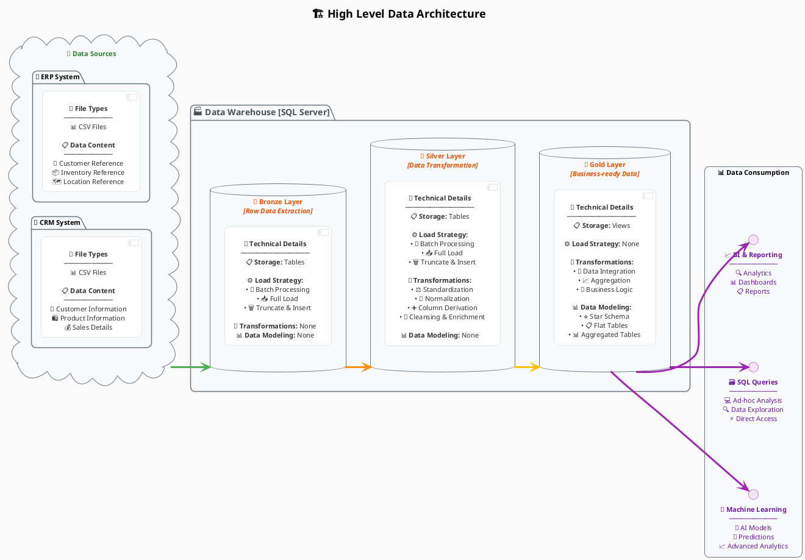

## 2. ETL Process Flow

```plantuml
@startuml DetailedExtractionProcess

skinparam {
  BackgroundColor      #FAFAFA
  RoundCorner          15
  DefaultTextAlignment center
  componentStyle       uml2
  DefaultFontSize      11
  TitleFontSize        16
  PackageFontSize      14
}

skinparam activity {
  BackgroundColor #E8F5E8
  BorderColor     #4CAF50
  FontColor       #2E7D32
}

skinparam component {
  BackgroundColor #FFFFFF
  BorderColor     #CCCCCC
  FontColor       #333333
}

title <size:18><b>🔍 Detailed Extraction Process</b></size>

start

package "📤 <b>Data Extraction</b>" {
  :📥 <b>Pull Extraction (Full)</b>;
  :🔍 <b>Parsing Technique</b>;
}

package "🔄 <b>Transformations</b>" {
  :🧹 <b>Standardization</b>;
  :🗑️ <b>Deduplication</b>;
  :✨ <b>Enrichment</b>;
  :⚖️ <b>Business Rule Application</b>;
  :🔧 <b>Data Cleansing</b>;
}

:📤 <b>Extract Data</b> --> :🔍 <b>Parse Data</b>;
:🔍 <b>Parse Data</b> --> :🧹 <b>Standardization</b>;
:🧹 <b>Standardization</b> --> :🗑️ <b>Deduplication</b>;
:🗑️ <b>Deduplication</b> --> :✨ <b>Enrichment</b>;
:✨ <b>Enrichment</b> --> :⚖️ <b>Business Rule Application</b>;
:⚖️ <b>Business Rule Application</b> --> :🔧 <b>Data Cleansing</b>;
:🔧 <b>Data Cleansing</b> --> stop

@enduml
```
## 2. ETL Process Flow

```plantuml
@startuml ETLProcess

skinparam {
  BackgroundColor      #FAFAFA
  RoundCorner          15
  DefaultTextAlignment center
  componentStyle       uml2
  DefaultFontSize      11
  TitleFontSize        16
  PackageFontSize      14
}

skinparam component {
  BackgroundColor #FFFFFF
  BorderColor     #CCCCCC
  FontColor       #333333
}

skinparam package {
  BackgroundColor #F8F9FA
  BorderColor     #6C757D
  FontColor       #495057
}

skinparam database {
  BackgroundColor #FFF3E0
  BorderColor     #FF8F00
  FontColor       #E65100
}

left to right direction
title <size:18><b>🔄 ETL Process Flow</b></size>

package "📤 <b>Extract</b>\n<i>[Data Acquisition]</i>" as Extract {
  component "🏢 <b>Data Sources</b>\n──────────────\n• 🤝 CRM System\n• 🏭 ERP System\n• 📊 External APIs\n• 📄 File Systems" as Sources
  component "🔗 <b>Connection Pool</b>\n──────────────\n• ⚡ Connection Management\n• 🔄 Load Balancing\n• ❗ Error Handling\n• 📊 Performance Monitoring" as Pool
  component "✅ <b>Data Validation</b>\n──────────────\n• 📋 Schema Validation\n• 🔍 Data Type Checks\n• 📏 Format Verification\n• 🚨 Alert Generation" as Validate
}

package "🔧 <b>Transform</b>\n<i>[Data Processing]</i>" as Transform {
  component "🧹 <b>Data Cleaning</b>\n──────────────\n• 🗑️ Remove Duplicates\n• ❌ Handle Nulls\n• 📏 Standardize Formats\n• 🔤 Text Normalization" as Clean
  component "✨ <b>Data Enrichment</b>\n──────────────\n• 🔗 Lookup Tables\n• ➕ Derived Fields\n• 🌍 Geographic Mapping\n• 📈 Calculated Metrics" as Enrich
  component "⚖️ <b>Business Rules</b>\n──────────────\n• 🎯 Logic Application\n• 📊 KPI Calculations\n• 🔄 Data Mapping\n• ✅ Validation Rules" as Rules
  component "🎯 <b>Quality Checks</b>\n──────────────\n• 📏 Completeness\n• ✅ Accuracy\n• 📊 Consistency\n• ⏱️ Timeliness" as Quality
}

package "📥 <b>Load</b>\n<i>[Data Persistence]</i>" as Load {
  component "🚀 <b>Bulk Insert</b>\n──────────────\n• ⚡ High Performance\n• 📦 Batch Processing\n• 🔄 Full Load Strategy\n• 💾 Memory Optimization" as Bulk
  component "🔄 <b>Incremental Load</b>\n──────────────\n• ⏰ Delta Processing\n• 📅 Change Detection\n• 🔀 Merge Operations\n• 📊 Update Tracking" as Incremental
  component "❗ <b>Error Handling</b>\n──────────────\n• 🚨 Exception Logging\n• 🔄 Retry Logic\n• 📧 Alert Notifications\n• 🗃️ Quarantine Data" as Error
}

database "🏗️ <b>Target DWH</b>\n<i>[Data Warehouse]</i>" as Target {
  component "🥉 <b>Storage Layers</b>\n──────────────\n• 🥉 Bronze Layer\n• 🥈 Silver Layer\n• 🥇 Gold Layer\n• 📊 Reporting Views" as Storage
}

Sources -[#4CAF50,thickness=3]-> Pool
Pool -[#4CAF50,thickness=3]-> Validate
Validate -[#FF8F00,thickness=3]-> Clean
Clean -[#FF8F00,thickness=3]-> Enrich
Enrich -[#FF8F00,thickness=3]-> Rules
Rules -[#FF8F00,thickness=3]-> Quality
Quality -[#9C27B0,thickness=3]-> Bulk
Quality -[#9C27B0,thickness=3]-> Incremental
Bulk -[#9C27B0,thickness=3]-> Target
Incremental -[#9C27B0,thickness=3]-> Target
Error -[#E91E63,thickness=2]-> Target

@enduml
```

## 3. Detailed Architecture

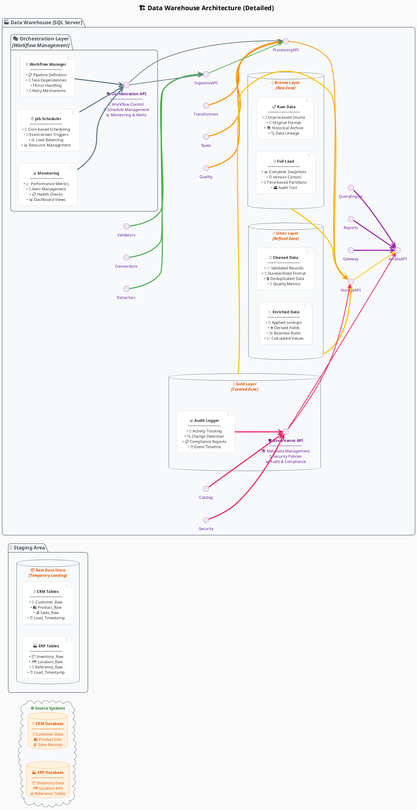

## 7. Data Catalog Architecture

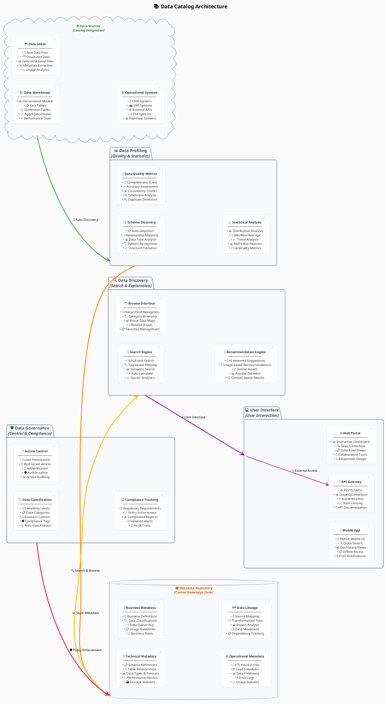

## 8. Bulk Insert vs Normal Insert Process

```plantuml
@startuml BulkInsertComparison_Final

skinparam {
  BackgroundColor      #FAFAFA
  RoundCorner          15
  DefaultTextAlignment center
  componentStyle       rectangle
  DefaultFontSize      11
  TitleFontSize        16
  PackageFontSize      14
}

' skinparam activity {
'   BackgroundColor #E8F5E8
'   BorderColor     #4CAF50
'   FontColor       #2E7D32
'   ArrowColor      #4CAF50
' }

skinparam component {
  BackgroundColor #FFFFFF
  BorderColor     #CCCCCC
  FontColor       #333333
}

skinparam package {
  BackgroundColor #F8F9FA
  BorderColor     #6C757D
  FontColor       #495057
}

skinparam database {
  BackgroundColor #FFF3E0
  BorderColor     #FF8F00
  FontColor       #E65100
}

top to bottom direction
title <size:18><b>Bulk Insert vs. Normal Insert Process Comparison</b></size>

package "Operational Workflows" {
  rectangle "Normal Insert Process
(Row-by-Row Processing)" as NormalInsertProc {
    start
    :Read Record 1 (Fetch Single Row);
    :Validate Record 1 (Data Quality Check);
    :Insert Record 1 (Single Row Insert);
    :Commit Transaction 1 (Database Commit);
    :Read Record 2 (Fetch Next Row);
    :Validate Record 2 (Data Quality Check);
    :Insert Record 2 (Single Row Insert);
    :Commit Transaction 2 (Database Commit);
    :... (Continues N times);
    :Read Record N (Fetch Final Row);
    :Validate Record N (Data Quality Check);
    :Insert Record N (Single Row Insert);
    :Commit Transaction N (Final Commit);
    end
  }

  rectangle "Bulk Insert Process
(Batch Processing)" as BulkInsertProc {
    start
    :Read All Records (Load Complete Dataset);
    :Validate All Records (Batch Quality Checks);
    :Prepare Bulk Statement (Optimize Query Plan);
    :Execute Bulk Insert (Batch Data Loading);
    :Single Commit (One Transaction Commit);
    :Error Handling (Batch Error Management);
    end
  }
}

database "Performance Comparison" as PerformanceSummary {
  component "<b>Normal Insert Metrics</b>\n--------------------\n<b>Performance:</b> Slow\n<b>Network Calls:</b> High\n<b>Memory Usage:</b> Low\n<b>Error Handling:</b> Granular\n<b>Transaction Overhead:</b> High\n<b>Best For:</b> Small Datasets" as NormalMetrics
  component "<b>Bulk Insert Metrics</b>\n--------------------\n<b>Performance:</b> Fast\n<b>Network Calls:</b> Low\n<b>Memory Usage:</b> High\n<b>Error Handling:</b> Batch-level\n<b>Transaction Overhead:</b> Low\n<b>Best For:</b> Large Datasets" as BulkMetrics
}

package "Pros & Cons Analysis" as AnalysisSummary {
  component "<b>Normal Insert (The Soloist)</b>\n------------------\n<b>Pros:</b>\n  - Better per-record error handling\n  - Individual record processing\n  - Lower memory requirements\n  - Granular control\n\n<b>Cons:</b>\n  - Slower overall performance\n  - More network round trips\n  - Higher transaction overhead\n  - Resource intensive for large data" as NormalAnalysis

  component "<b>Bulk Insert (The Team Player)</b>\n------------------\n<b>Pros:</b>\n  - Much faster performance\n  - Fewer network round trips\n  - Lower transaction overhead\n  - Optimized for large datasets\n\n<b>Cons:</b>\n  - Higher memory usage (temporary spike)\n  - All-or-nothing approach to errors\n  - Complex error handling & rollbacks\n  - Requires more upfront planning" as BulkAnalysis
}

NormalInsertProc -[#4CAF50,thickness=2]-> PerformanceSummary
BulkInsertProc -[#FF8F00,thickness=2]-> PerformanceSummary
PerformanceSummary -[#9C27B0,thickness=2]-> AnalysisSummary

@enduml
```

## 9. Dimensions vs Measures

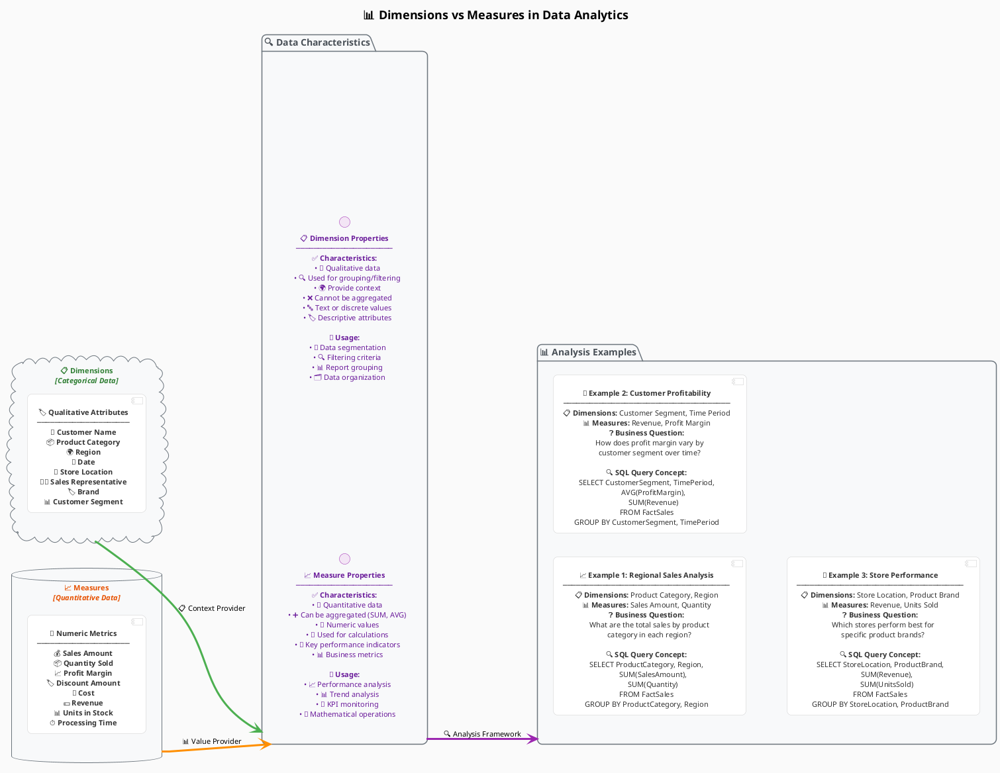

## 10. GIT Workflow

```plantuml
@startuml GitWorkflow

skinparam {
  BackgroundColor      #FAFAFA
  RoundCorner          15
  DefaultTextAlignment center
  componentStyle       uml2
  DefaultFontSize      11
  TitleFontSize        16
  PackageFontSize      14
}

skinparam cloud {
  BackgroundColor #E8F5E8
  BorderColor     #4CAF50
  FontColor       #2E7D32
}

skinparam database {
  BackgroundColor #FFF3E0
  BorderColor     #FF8F00
  FontColor       #E65100
}

skinparam interface {
  BackgroundColor #F3E5F5
  BorderColor     #9C27B0
  FontColor       #6A1B9A
}

skinparam component {
  BackgroundColor #FFFFFF
  BorderColor     #CCCCCC
  FontColor       #333333
}

skinparam package {
  BackgroundColor #F8F9FA
  BorderColor     #6C757D
  FontColor       #495057
}

left to right direction
title <size:18><b>🔄 GIT Workflow for Data Warehouse Development</b></size>

cloud "💻 <b>Development Environment</b>\n<i>[Local Development]</i>" as Dev {
  component "🌿 <b>Feature Branch</b>\n─────────────────────\n• 🚀 feature/new-etl-pipeline\n• 🐛 bugfix/data-quality-fix\n• 🔧 hotfix/urgent-schema-change\n• ✨ enhancement/performance-tune" as Feature
  component "💻 <b>Local Development</b>\n─────────────────────\n• 📝 Code Development\n• 🧪 Local Testing\n• 🔍 Code Reviews\n• 📊 Performance Testing" as Local
  component "🧪 <b>Unit Tests</b>\n─────────────────────\n• ✅ SQL Query Testing\n• 📊 Data Validation\n• 🔧 ETL Logic Tests\n• 📈 Performance Benchmarks" as UnitTest
}

database "🧪 <b>Testing Environment</b>\n<i>[Integration Testing]</i>" as Test {
  component "🔗 <b>Integration Branch</b>\n─────────────────────\n• 🔄 develop branch\n• 🧪 Feature integration\n• 🔍 Cross-feature testing\n• 📊 System validation" as Integration
  component "✅ <b>Data Validation</b>\n─────────────────────\n• 🎯 Data Quality Checks\n• 📏 Schema Validation\n• 🔍 Business Rule Testing\n• 📊 End-to-end Testing" as Validation
  component "⚡ <b>Performance Testing</b>\n─────────────────────\n• 🚀 Load Testing\n• 📊 Query Performance\n• 💾 Memory Usage\n• ⏱️ ETL Runtime Analysis" as PerfTest
}

interface "🚀 <b>Production Environment</b>\n<i>[Live System]</i>" as Prod {
  component "🎯 <b>Main Branch</b>\n─────────────────────\n• 🚀 main/master branch\n• 📦 Production-ready code\n• 🔒 Protected branch\n• 📋 Release tags" as Main
  component "🚀 <b>Production Deployment</b>\n─────────────────────\n• 🤖 Automated CI/CD\n• 📦 Docker Containers\n• ⚙️ Configuration Management\n• 🔄 Blue-Green Deployment" as Deploy
  component "📊 <b>Monitoring</b>\n─────────────────────\n• 📈 System Health\n• 🚨 Alert Management\n• 📋 Performance Metrics\n• 📊 Business Intelligence" as Monitor
}

package "📂 <b>Repository Structure</b>\n<i>[Code Organization]</i>" as Repo {
  component "🗃️ <b>Project Structure</b>\n─────────────────────────\n📁 <b>/sql/</b>\n   ├── 📁 /ddl/ - Table definitions\n   ├── 📁 /dml/ - Data manipulation\n   └── 📁 /views/ - View definitions\n📁 <b>/etl/</b>\n   ├── 📁 /pipelines/ - ETL code\n   ├── 📁 /scripts/ - Utility scripts\n   └── 📁 /configs/ - Configuration\n📁 <b>/models/</b>\n   ├── 📁 /dimensional/ - Star schema\n   └── 📁 /staging/ - Staging models\n📁 <b>/tests/</b>\n   ├── 📁 /unit/ - Unit tests\n   └── 📁 /integration/ - Integration tests\n📁 <b>/docs/</b>\n   ├── 📄 README.md\n   ├── 📄 ARCHITECTURE.md\n   └── 📁 /diagrams/" as RepoStructure
}

package "🔄 <b>Workflow Process</b>" as WorkflowProcess {
  component "1️⃣ <b>Feature Development</b>\n─────────────────────────\n🌿 Create feature branch\n💻 Develop locally\n🧪 Run unit tests\n📝 Commit changes\n🔍 Code review" as Step1
  
  component "2️⃣ <b>Integration Testing</b>\n─────────────────────────\n🔀 Pull request to develop\n🤖 Automated CI pipeline\n✅ Data validation tests\n⚡ Performance checks\n👥 Team review" as Step2
  
  component "3️⃣ <b>Production Release</b>\n─────────────────────────\n🔀 Merge to main branch\n🚀 Automated deployment\n📊 Production monitoring\n🚨 Alert setup\n📋 Release documentation" as Step3
}

Feature -[#4CAF50,thickness=3]-> Integration : "📤 Pull Request"
Integration -[#FF8F00,thickness=3]-> Main : "🔀 Merge to Main"
Local -[#4CAF50,thickness=2]-> UnitTest : "🧪 Run Tests"
UnitTest -[#4CAF50,thickness=2]-> Feature : "💾 Commit Changes"
Integration -[#FF8F00,thickness=2]-> Validation : "✅ Validate Data"
Validation -[#FF8F00,thickness=2]-> PerfTest : "⚡ Performance Check"
Main -[#9C27B0,thickness=3]-> Deploy : "🤖 Automated Deployment"
Deploy -[#9C27B0,thickness=2]-> Monitor : "📊 Production Monitoring"

Repo -[#607D8B,thickness=2]-> Dev : "📥 Checkout Code"
Repo -[#607D8B,thickness=2]-> Test : "🔄 CI/CD Pipeline"
Repo -[#607D8B,thickness=2]-> Prod : "🚀 Release"

@enduml
```

## Usage Instructions

1. **Copy any diagram** from above and paste it into a PlantUML editor
2. **Customize the diagrams** by modifying:
   - Colors and styling (skinparam sections)
   - Component names and descriptions
   - Relationships>Business Models</b>\n──────────────\n• 📈 Aggregated Metrics\n• 🎯 Key Performance KPIs\n• 📋 Analytics Views\n• 🔍 Query Optimization" as Gold_Model
    component "⭐ <b>Star Schema</b>\n──────────────\n• 📋 Dimension Tables\n• 📊 Fact Tables\n• 🔗 Relationship Models\n• 🚀 Performance Tuned" as Gold_Star
  }
}

rectangle "📊 Data Access Layer" as DataAccess {
  interface "📈 <b>BI Tools</b>\n──────────────\n🔍 Power BI\n📊 Tableau\n📋 SSRS Reports" as BI
  interface "🗃️ <b>SQL Queries</b>\n──────────────\n💻 Ad-hoc Analysis\n🔍 Data Mining\n⚡ Direct Access" as Reports
  interface "🤖 <b>ML Pipelines</b>\n──────────────\n🧠 Model Training\n🔮 Predictions\n📈 Analytics" as ML
}

CRM_DB -[#4CAF50,thickness=3]-> CRM_Stage
ERP_DB -[#4CAF50,thickness=3]-> ERP_Stage

CRM_Stage -[#FF8F00,thickness=3]-> Bronze_Raw
ERP_Stage -[#FF8F00,thickness=3]-> Bronze_Raw

Bronze_Raw -[#FF8F00,thickness=3]-> Silver_Clean
Silver_Clean -[#FFC107,thickness=3]-> Silver_Enrich
Silver_Enrich -[#FFC107,thickness=3]-> Gold_Model
Silver_Enrich -[#FFC107,thickness=3]-> Gold_Star

Gold_Model -[#9C27B0,thickness=3]-> BI
Gold_Star -[#9C27B0,thickness=3]-> Reports
Gold_Model -[#9C27B0,thickness=3]-> ML

@enduml
```

## 4. Data Modeling - Star Schema

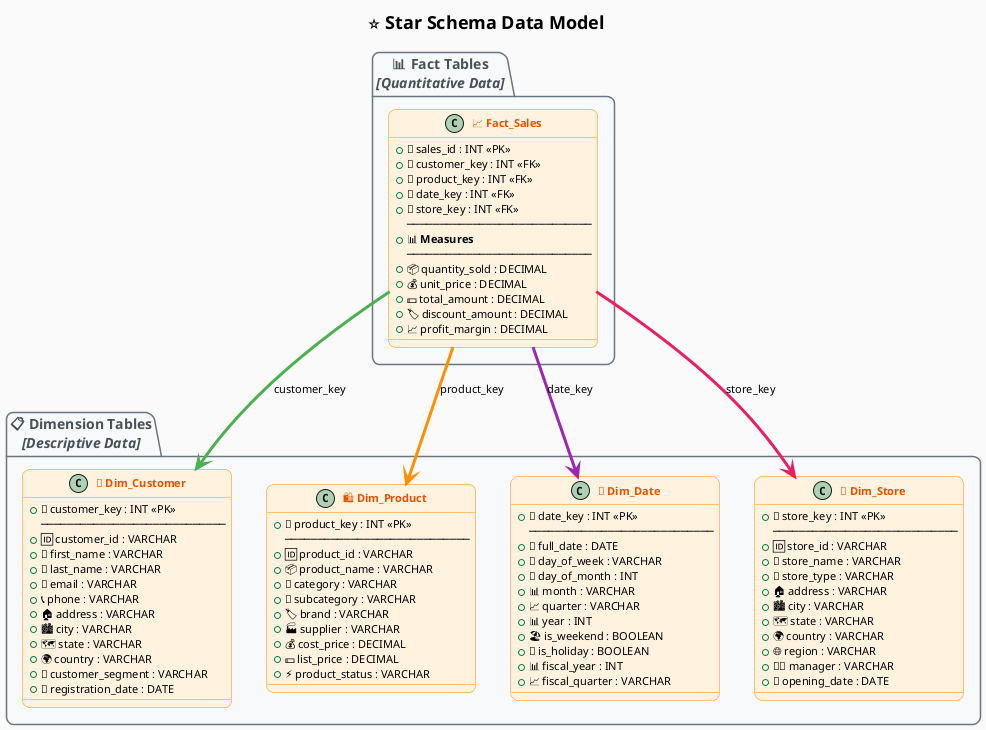

## 5. Data Integration Process

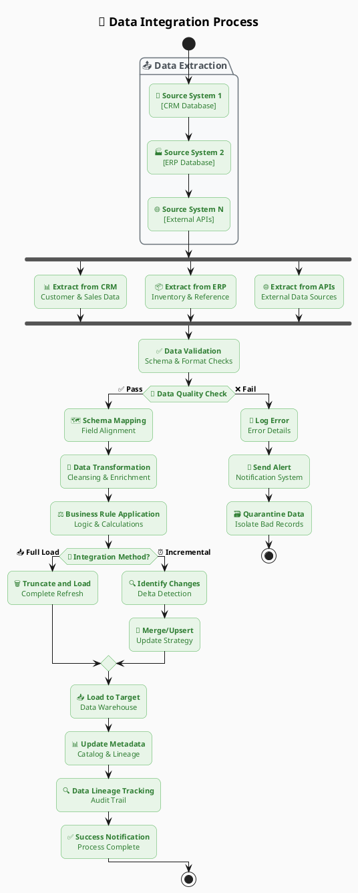

## 6. Separation of Concerns (SOC) Architecture

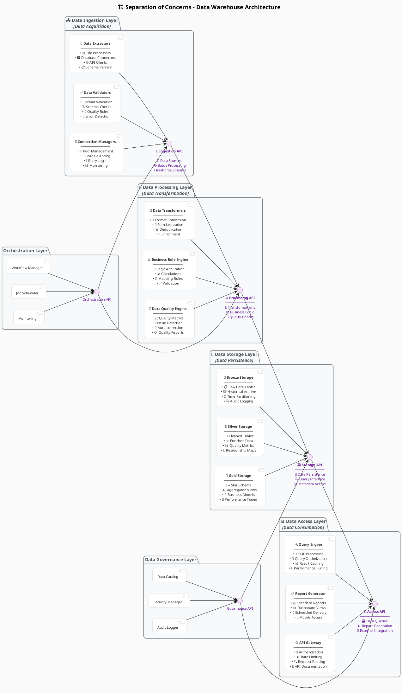

## 7. Data Catalog Architecture

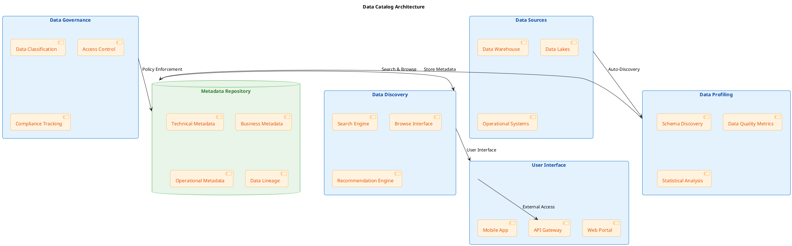

## 8. Bulk Insert vs Normal Insert Process

```plantuml
@startuml BulkInsertComparison

skinparam {
  BackgroundColor #FFFFFF
  RoundCorner 8
  DefaultTextAlignment center
}

skinparam rectangle {
  BackgroundColor #E8F6F3
  BorderColor #1ABC9C
  FontColor #148F77
}

skinparam activity {
  BackgroundColor #FDF2E9
  BorderColor #E67E22
  FontColor #A0522D
}

title Bulk Insert vs Normal Insert Process Comparison

rectangle "Normal Insert Process" as NormalInsert {
  activity "Read Record 1" as Read1
  activity "Validate Record 1" as Val1
  activity "Insert Record 1" as Ins1
  activity "Commit Transaction 1" as Com1
  activity "Read Record 2" as Read2
  activity "Validate Record 2" as Val2
  activity "Insert Record 2" as Ins2
  activity "Commit Transaction 2" as Com2
  activity "..." as Dots1
  activity "Read Record N" as ReadN
  activity "Validate Record N" as ValN
  activity "Insert Record N" as InsN
  activity "Commit Transaction N" as ComN
}

rectangle "Bulk Insert Process" as BulkInsert {
  activity "Read All Records" as ReadAll
  activity "Validate All Records" as ValAll
  activity "Prepare Bulk Statement" as Prepare
  activity "Execute Bulk Insert" as Execute
  activity "Single Commit" as SingleCommit
  activity "Error Handling" as ErrorHandle
}

Read1 --> Val1
Val1 --> Ins1
Ins1 --> Com1
Com1 --> Read2
Read2 --> Val2
Val2 --> Ins2
Ins2 --> Com2
Com2 --> Dots1
Dots1 --> ReadN
ReadN --> ValN
ValN --> InsN
InsN --> ComN

ReadAll --> ValAll
ValAll --> Prepare
Prepare --> Execute
Execute --> SingleCommit
SingleCommit --> ErrorHandle

note right of NormalInsert
  **Pros:**
  - Better error handling per record
  - Can process records individually
  - Less memory usage
  
  **Cons:**
  - Slower performance
  - More network round trips
  - Higher transaction overhead
end note

note right of BulkInsert
  **Pros:**
  - Much faster performance
  - Fewer network round trips
  - Lower transaction overhead
  - Better for large datasets
  
  **Cons:**
  - Higher memory usage
  - All-or-nothing approach
  - More complex error handling
end note

@enduml
```

## 9. Dimensions vs Measures

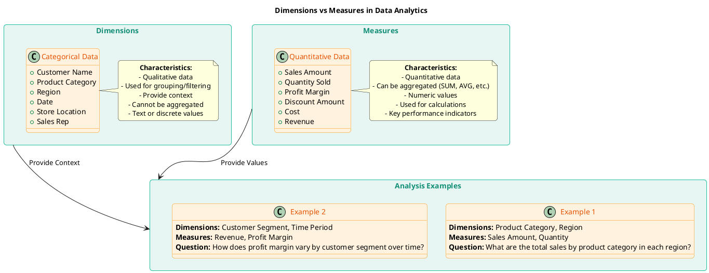

## 10. GIT Workflow

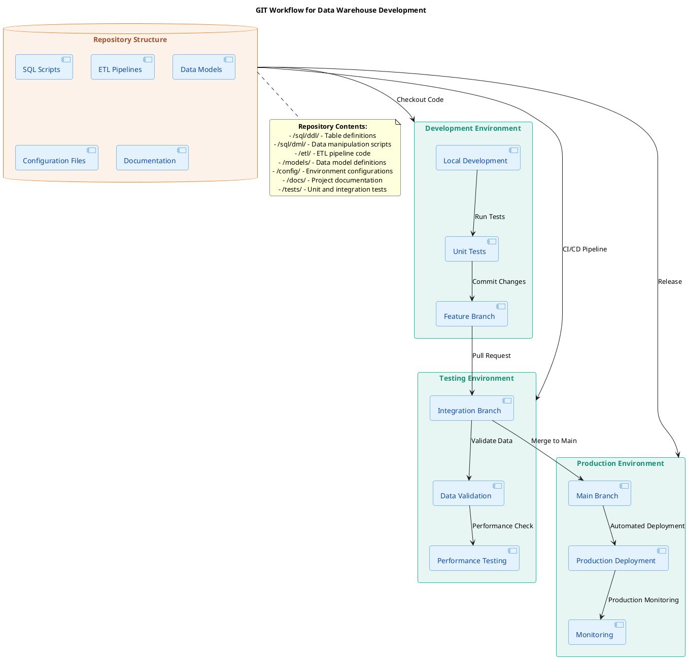

## Usage Instructions

1. **Copy any diagram** from above and paste it into a PlantUML editor
2. **Customize the diagrams** by modifying:
   - Colors and styling (skinparam sections)
   - Component names and descriptions
   - Relationships and connections
   - Notes and annotations

3. **Popular PlantUML editors:**
   - Online: plantuml.com/plantuml
   - VS Code: PlantUML extension
   - IntelliJ: PlantUML integration plugin
   - Standalone: PlantUML jar file

4. **Export formats available:**
   - PNG (images)
   - SVG (scalable vector graphics)
   - PDF (documents)
   - LaTeX (for academic papers)

Each diagram represents a different aspect of your SQL Data Warehouse project and can be used for documentation, presentations, or architectural discussions.